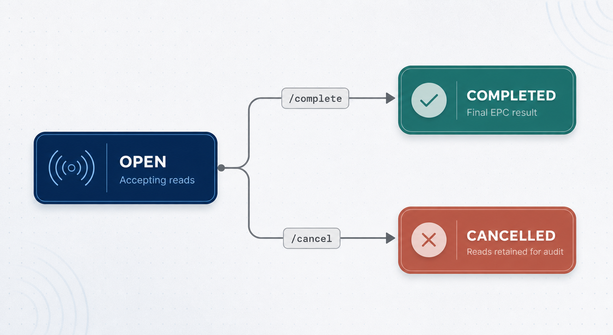

import { Aside, Steps } from '@astrojs/starlight/components';

The core module. Start a **session** and the reader turns on, streaming EPC reads into it. Stop to close it and read the deduped result. Both ETP POS and Samooha drive scanning here. Every session references one [scan activity](/scan-activities/). All endpoints require [`x-api-key`](/authentication/).

## Base URL

```
https://rfid-middleware.geoplanph.com/api/v1
```

Success responses are wrapped as `{ statusCode, message, data }` (plus `meta` on the paginated list). Errors are `{ statusCode, message, error, path, timestamp }`. Rate limit: 100 requests / 60s.

## Session lifecycle



`OPEN` accepts reads. `/complete` and `/cancel` are terminal and only work on an `OPEN` session (`409` otherwise).

## Who calls what

| actor | calls |
| --- | --- |
| **Your system** (ETP / Samooha) | `POST /sessions`, `GET /sessions/:id` (poll), `/complete`, `/cancel` |
| **Reader / bridge agent** (Geoplan-managed) | `POST /sessions/:id/reads` (you don't call this) |

## ETP POS checkout flow

<Steps>

1. Customer's items on the counter. Cashier taps **Start**.
2. `POST /epc-scan-processing/sessions` with the POS-sale activity and the lane reader → session `OPEN`, reader switches on.
3. Reader scans continuously. The bridge agent appends reads to the session.
4. POS polls `GET /epc-scan-processing/sessions/:id` for the live deduped `epcs` and shows the count.
5. Cashier taps **Stop** → `POST …/complete` → `COMPLETED`, reader off, final `epcs` returned. POS resolves EPCs → SKUs and bills.
6. Order abandoned → `POST …/cancel` instead.

</Steps>

Samooha warehouse flows are identical: swap the activity (Goods Receipt, Stock Transfer, …) and the reader (dock, handheld, gate).

## Session fields

| field | type | notes |
| --- | --- | --- |
| `id` | uuid | session id |
| `transactionReference` | string \| null | your order/bill/document ref |
| `deviceId` | string (uuid) | `id` of the reader the session runs on |
| `scanActivity` | `{ id, code, name }` | the activity referenced |
| `status` | enum | `OPEN` \| `COMPLETED` \| `CANCELLED` |
| `startedAt` | ISO-8601 | |
| `completedAt` | ISO-8601 \| null | set on complete |
| `uniqueCount` | int | distinct EPCs |
| `epcs` | string[] | distinct EPCs, upper-cased, sorted asc (omitted on the list endpoint) |

## POST /epc-scan-processing/sessions

Opens a session and starts the reader. Returns `201`.

| field | type | required | notes |
| --- | --- | --- | --- |
| `scanActivityId` | uuid | yes | an **active** activity. `404` unknown, `400` archived |
| `deviceId` | uuid | yes | `id` of an **active** [registered reader](/rfid-readers/). `404` unknown, `400` if not active |
| `transactionReference` | string | no | ≤ 120. Your order / bill / delivery ref |

```json
// request
{ "scanActivityId": "7e2f9a10-4b3d-4c2a-8f61-1a9d6e4b2c10", "deviceId": "5f3b9d2a-1c44-4e8a-9b77-2a6f0d1e3c88", "transactionReference": "TXN-001" }
```

```json
// 201
{
  "statusCode": 201,
  "message": "Success",
  "data": {
    "id": "38a7393e-7750-4437-9c0f-b69db6e247b5",
    "transactionReference": "TXN-001",
    "deviceId": "5f3b9d2a-1c44-4e8a-9b77-2a6f0d1e3c88",
    "scanActivity": { "id": "7e2f9a10-4b3d-4c2a-8f61-1a9d6e4b2c10", "code": "POS_SALE", "name": "POS Sale" },
    "status": "OPEN",
    "startedAt": "2026-07-22T02:10:00.000Z",
    "completedAt": null,
    "uniqueCount": 0,
    "epcs": []
  }
}
```

<Aside type="note">`deviceId` is the reader's `id` (a UUID). List readers via [GET /rfid-readers](/rfid-readers/) and let staff pick one before scanning. SSI configures readers in the dashboard. Starting a session commands that reader over HTTPS to begin scanning. `/complete` and `/cancel` stop it. A physical reader failure is returned as an error.</Aside>

## GET /epc-scan-processing/sessions/:id

Full session including the live deduped `epcs`. Poll while `OPEN` to show progress. `404` if unknown.

```json
{
  "statusCode": 200,
  "message": "Success",
  "data": {
    "id": "38a7393e-7750-4437-9c0f-b69db6e247b5",
    "transactionReference": "TXN-001",
    "deviceId": "5f3b9d2a-1c44-4e8a-9b77-2a6f0d1e3c88",
    "scanActivity": { "id": "7e2f9a10-4b3d-4c2a-8f61-1a9d6e4b2c10", "code": "POS_SALE", "name": "POS Sale" },
    "status": "OPEN",
    "startedAt": "2026-07-22T02:10:00.000Z",
    "completedAt": null,
    "uniqueCount": 2,
    "epcs": ["3034F4A9…01", "3034F4A9…02"]
  }
}
```

## GET /epc-scan-processing/sessions

Paginated list, ordered by `startedAt` desc. List items carry `uniqueCount` but **not** `epcs`. Fetch a single session for the EPCs.

| param | type | default | notes |
| --- | --- | --- | --- |
| `status` | enum | - | `OPEN` \| `COMPLETED` \| `CANCELLED` |
| `deviceId` | string | - | exact match |
| `scanActivityId` | uuid | - | audit: every session under one process |
| `page` | int | 1 | ≥ 1 |
| `limit` | int | 10 | 1–50 |

```json
{
  "statusCode": 200,
  "message": "Success",
  "data": [
    {
      "id": "38a7393e-7750-4437-9c0f-b69db6e247b5",
      "transactionReference": "TXN-001",
      "deviceId": "5f3b9d2a-1c44-4e8a-9b77-2a6f0d1e3c88",
      "scanActivity": { "id": "7e2f9a10-4b3d-4c2a-8f61-1a9d6e4b2c10", "code": "POS_SALE", "name": "POS Sale" },
      "status": "OPEN",
      "uniqueCount": 2,
      "startedAt": "2026-07-22T02:10:00.000Z",
      "completedAt": null
    }
  ],
  "meta": { "total": 1, "page": 1, "limit": 10, "lastPage": 1 }
}
```

## POST /epc-scan-processing/sessions/:id/reads

Reader/bridge-facing: appends EPCs to an `OPEN` session. **Your system normally does not call this.** The reader does. Documented for completeness. Returns `200` with the full session.

| field | type | notes |
| --- | --- | --- |
| `epcs` | string[] | 1–1000 items, each ≤ 128 chars |

EPCs are trimmed, upper-cased, and deduplicated. Re-reads increment an internal count but never duplicate a session's `epcs`. `404` if the session is unknown, `409` if it is not `OPEN`.

```json
// request
{ "epcs": ["3034f4a9…01", "3034F4A9…02", "3034F4A9…01"] }
```

## POST /epc-scan-processing/sessions/:id/complete

**Stop.** Marks the session `COMPLETED`, sets `completedAt`, stops the reader, and returns the full session with the final `epcs`. `409` if not `OPEN`, `404` if unknown.

```json
// 200
{
  "statusCode": 200,
  "message": "Success",
  "data": {
    "id": "38a7393e-7750-4437-9c0f-b69db6e247b5",
    "status": "COMPLETED",
    "completedAt": "2026-07-22T02:10:20.000Z",
    "uniqueCount": 2,
    "epcs": ["3034F4A9…01", "3034F4A9…02"],
    "scanActivity": { "id": "7e2f9a10-4b3d-4c2a-8f61-1a9d6e4b2c10", "code": "POS_SALE", "name": "POS Sale" },
    "transactionReference": "TXN-001",
    "deviceId": "5f3b9d2a-1c44-4e8a-9b77-2a6f0d1e3c88",
    "startedAt": "2026-07-22T02:10:00.000Z"
  }
}
```

## POST /epc-scan-processing/sessions/:id/cancel

Marks the session `CANCELLED` and stops the reader. Any reads already captured are retained for audit but not treated as a result. `409` if not `OPEN`, `404` if unknown. Returns the session.

## Errors

| status | when |
| --- | --- |
| 400 | Invalid body/param, archived `scanActivityId`, inactive reader, or empty `epcs`. |
| 401 | Missing or invalid `x-api-key`. |
| 404 | Session, activity, or reader not found. |
| 409 | Action requires an `OPEN` session (already completed/cancelled). |
| 429 | Rate limit exceeded (100 req/60s). |
