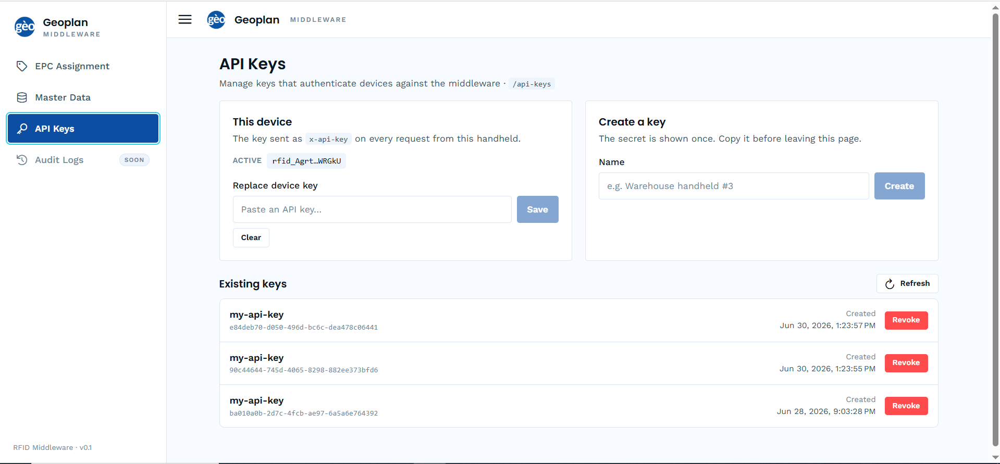
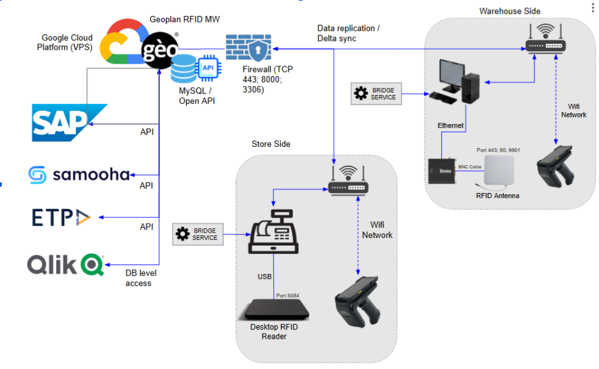

import { CardGrid, LinkCard } from '@astrojs/starlight/components';

Geoplan middleware turns reader hardware into EPC reads your system can consume. Open a scan session, the reader turns on and streams EPCs into it, you read the deduped result, then stop. ETP POS and Samooha both integrate through the same core flow.

## Before you start

This assumes setup is already done in the Geoplan dashboard: EPC assignment, master data sync, your API key, and your scan activities. None of that is covered in this reference, this covers the integration itself.

## Pick your system

<CardGrid>
  <LinkCard
    title="ETP POS"
    href="/etp-pos/"
    description="Checkout scan flow, step by step."
  />
  <LinkCard
    title="Samooha"
    href="/samooha/"
    description="Warehouse scan flow, step by step."
  />
</CardGrid>

## Full API reference

Everything above links back to these. Come here for exact field types, full error tables, and edge cases.

<CardGrid>
  <LinkCard
    title="Authentication"
    href="/authentication/"
    description="x-api-key on every request."
  />
  <LinkCard
    title="Scan Activities"
    href="/scan-activities/"
    description="Look up the processes you scan under."
  />
  <LinkCard
    title="EPC Scan Processing"
    href="/epc-scan-processing/"
    description="Start, poll, and complete a scan session. The core flow."
  />
  <LinkCard
    title="RFID Readers"
    href="/rfid-readers/"
    description="List the reader devices, pick one as a session's deviceId."
  />
  <LinkCard
    title="Exception Handling"
    href="/exceptions/"
    description="Read and resolve system-raised exceptions."
  />
</CardGrid>

## Other systems

[Qlik](/qlik/) reads the database directly, no REST API involved. [SAP (Proposed)](/sap/) is a draft goods-movement posting contract, not yet live.
