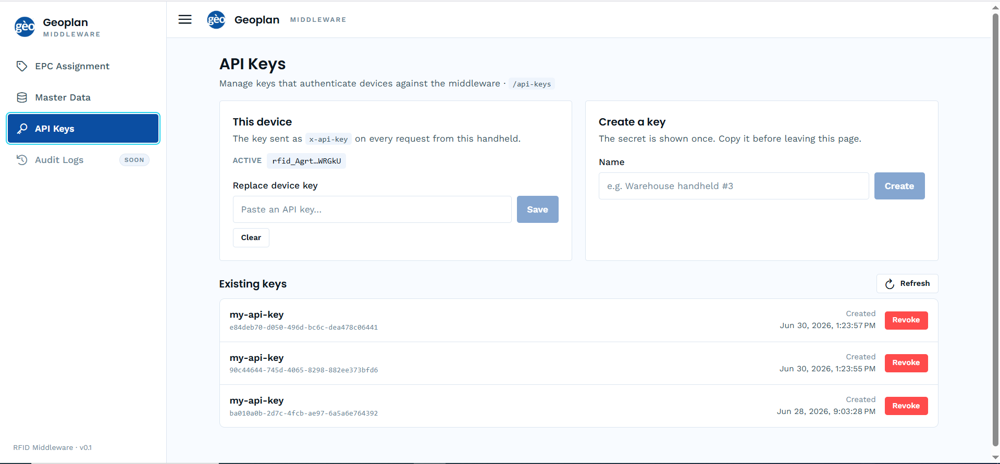
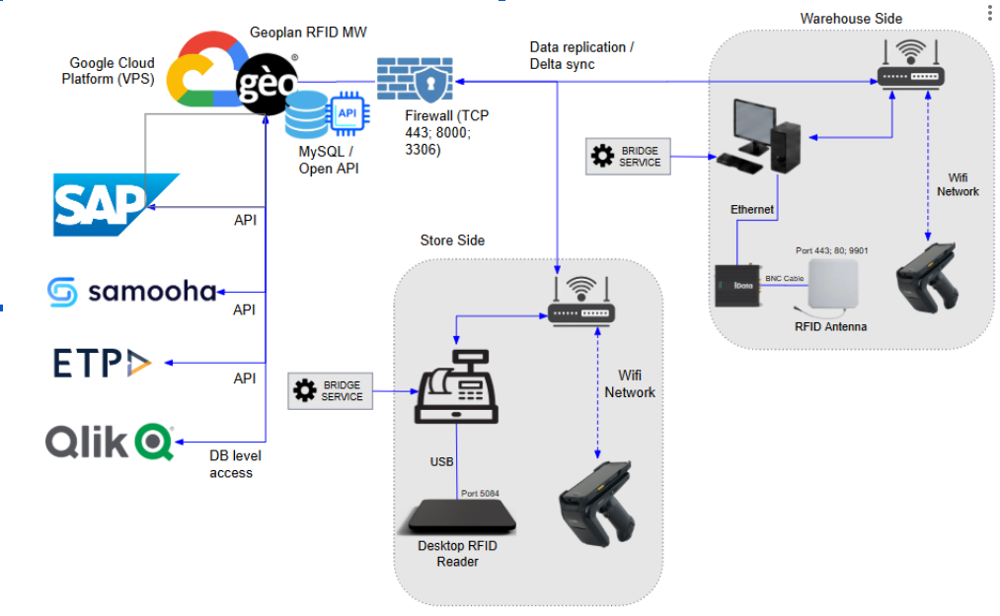

import { CardGrid, LinkCard } from '@astrojs/starlight/components';

Geoplan connects RFID readers, master data, and transaction systems. Start with the system you are integrating.

## Before you start

Connection setup uses the Geoplan dashboard for API keys, scan activities, readers, and EPC assignment.

## Integrations

<CardGrid>
  <LinkCard
    title="ON Principal"
    href="/on-principal/master-data-sync/"
    description="Nedap Harmony master data and EPC lookup."
  />
  <LinkCard
    title="Samooha"
    href="/samooha/"
    description="Warehouse master data and scan sessions."
  />
  <LinkCard
    title="ETP POS"
    href="/etp-pos/"
    description="Checkout RFID scan flow."
  />
  <LinkCard
    title="SAP"
    href="/sap/"
    description="Proposed goods-movement integration."
  />
</CardGrid>

