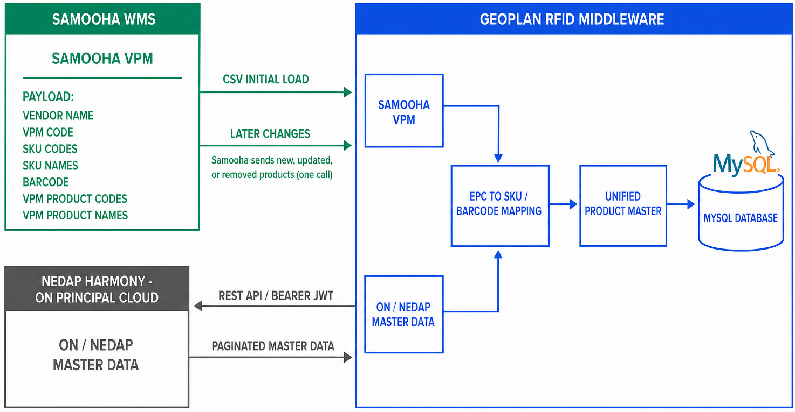

Geoplan retrieves ON master data directly from Nedap Harmony. Samooha is not in this path.



## Data direction

| Item | Contract |
| --- | --- |
| Caller | Geoplan |
| Provider | Nedap Harmony |
| Transport | HTTPS REST |
| Response format | JSON |
| Authentication | Bearer JWT |
| Required scope | `read:masterdata` |
| Server | `https://nedap-harmony.com` |
| Workspace | `{workspaceId}` UUID supplied for the ON workspace |
| Environment | `test=true` for test. Omit it or use `false` for live. |

The ON distributor requirement selects REST with CSV for product-master import into Harmony. That is separate from the Geoplan read interface, which returns JSON.

## Paginate master data

Use the current pagination endpoint. The supplied `GET /api/{workspaceId}/master-data/v1` list endpoint is deprecated.

```http
POST https://nedap-harmony.com/api/{workspaceId}/master-data/v1/paginate?test=true&sortField=LastModification&sortDirection=Ascending
Authorization: Bearer <jwt>
Content-Type: application/json
```

Full baseline request:

```json
{}
```

Incremental request:

```json
{
  "lastModification": {
    "greaterThanOrEqual": "<last-successful-checkpoint>"
  },
  "activeOnly": false
}
```

| Input | Location | Use |
| --- | --- | --- |
| `test` | Query | Select test or live data. |
| `sortField` | Query | Use `LastModification` for incremental processing. |
| `sortDirection` | Query | Use `Ascending`. |
| `pageSize` | Query | Optional page size. |
| `nextPageToken` | Query | Token returned by the previous page. |
| `types` | Body | Optional list of Harmony master-data types. |
| `references` | Body | Optional list of exact source references. |
| `lastModification` | Body | Date-time comparison filter for incremental reads. |
| `activeOnly` | Body | Set `false` when inactive records must remain visible to the adapter. |

## Sync sequence

1. Send `{}` for the first baseline.
2. Process every item in `data`.
3. If `nextPageToken` is present, send the same filter with that token.
4. Store the latest successful `lastModification` only after all pages succeed.
5. Use that checkpoint in the next incremental request.

Using `greaterThanOrEqual` prevents records that share the checkpoint timestamp from being skipped. Geoplan handles repeated items as idempotent upserts.

## Response

```json
{
  "data": [
    {
      "id": "<harmony-master-data-id>",
      "description": "<product-description>",
      "imageUrl": null,
      "active": true,
      "details": {},
      "type": "<workspace-master-data-type>",
      "reference": "<workspace-reference>",
      "test": true,
      "lastModification": "<ISO-8601 timestamp>"
    }
  ],
  "nextPageToken": null,
  "totalCount": 1
}
```

| Field | Use |
| --- | --- |
| `id` | Harmony record identifier. |
| `type` | Workspace master-data type. |
| `reference` | Source reference used by Harmony. |
| `description` | Display description. |
| `details` | Workspace-specific product attributes. |
| `active` | Harmony active flag. |
| `lastModification` | Incremental checkpoint value. |
| `nextPageToken` | Cursor for the next page. `null` ends the run. |

The ON product-master requirement includes GTIN/EAN, SKU, Brand, Product Name, Color, Size, and Department. Harmony does not prescribe those as fixed JSON keys in this response. Geoplan maps the actual ON workspace `type`, `reference`, and `details` structure into its unified product master.

## Resolve EPCs to master data

Harmony also accepts EPCs and returns the related master-data items:

```http
POST https://nedap-harmony.com/api/{workspaceId}/master-data/v1/filter-epcs?test=true
Authorization: Bearer <jwt>
Content-Type: application/json
```

```json
[
  {
    "hexadecimal": "302ED64632F03133394221CE"
  }
]
```

The response contains `filteredEpcs` and `masterDataItems`. Geoplan uses this boundary for EPC-to-product resolution without requiring Samooha to receive or store EPC values.

## Required setup

| Value | Source |
| --- | --- |
| Test and live `workspaceId` | ON or Nedap Harmony |
| JWT with `read:masterdata` | ON or Nedap Harmony |
| Master-data types used in the workspace | Harmony `ListMasterDataTypes` endpoint |
| Workspace sample response | ON test workspace |

## Responses

| Status | Meaning |
| --- | --- |
| `200` | Request completed. |
| `401` | Bearer token is missing or invalid. |
| `403` | Token lacks workspace access or `read:masterdata`. |
| `429` | Harmony rate limit exceeded. |

Official contract: [PaginateMasterData](https://documentation.nedap-harmony.com/reference/paginatemasterdata), [FilterEpcsByMasterData](https://documentation.nedap-harmony.com/reference/filterepcsbymasterdata-1), and [ListMasterData](https://documentation.nedap-harmony.com/reference/listmasterdata).
