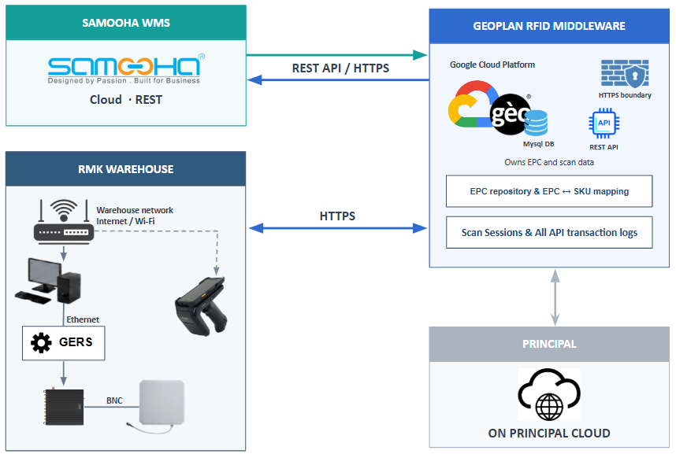

Samooha POSTs GRN, CRN, GD, and VRN documents to Geoplan in batches. A warehouse user on the Geoplan app picks a document and starts the scan. Geoplan POSTs scan results back only for GRN. Geoplan manages scan sessions, EPC data, and EPC-to-SKU mapping. Samooha remains the source of transaction documents and owns inventory updates.

The diagram shows the Samooha, warehouse, Geoplan middleware, and ON Principal connections:

## Scope

| Flow | Data exchange | Source document reference |
| --- | --- | --- |
| Goods Receipt | Samooha POSTs the document in a batch. After scan, Geoplan POSTs scanned quantity per SKU. | Purchase Invoice |
| Goods Delivery | Samooha POSTs the document in a batch. No scan-result return leg. | Sales Order |
| Customer Returns | Samooha POSTs the document in a batch. No scan-result return leg. | Credit Note |
| Vendor Returns | Samooha POSTs the document in a batch. No scan-result return leg. | Debit Note |

Goods Delivery, Customer Returns, and Vendor Returns have no scan-result return leg. Every request still receives an HTTP acknowledgement.

RFID scope excludes put-away, picking, packing, stock transfer, and cycle count.

## Process flow

| Step | Actor | Action |
| --- | --- | --- |
| 1 | Samooha | POST GRN, CRN, GD, and VRN documents in batches. |
| 2 | Warehouse user | Pick a document on the Geoplan app and start the scan. |
| 3 | Geoplan | POST scan results to Samooha only for GRN. |

## Integration rules

- Samooha initiates document ingest. Geoplan does not expose webhooks. Geoplan POSTs Goods Receipt results to Samooha's documented endpoint.
- Transaction calls use `POST` for audit integrity.
- Samooha filters transaction lines to RFID-enabled ON products.
- Product identity in transaction lines is the SKU. Barcode, VPM code, and product details come from synced master data.
- Geoplan POSTs SKU and scanned quantity to Samooha for Goods Receipt. EPC values stay in Geoplan.
- One API key covers the Samooha integration within an environment.

## Integration order

| Page | Use |
| --- | --- |
| [Authentication](/samooha/authentication/) | Send the integration API key |
| [Master Data](/samooha/master-data/) | Load product data before transaction calls |
| [Transaction Documents](/samooha/transaction-documents/) | GRN, CRN, GD, and VRN ingest, and the GRN result post |
| [Scan Activities](/samooha/scan-activities/) | Use the four fixed activity IDs |
| [Scan Sessions](/samooha/scan-sessions/) | Session API, flow rules, and known limitations |
| [Errors & Retries](/samooha/errors-and-retries/) | HTTP status reference |
