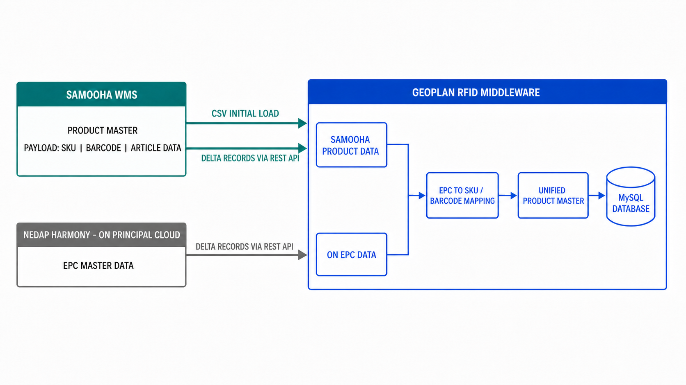

Samooha exposes its existing product master and vendor product mapping. ON/Nedap supplies EPC master data directly to Geoplan, not through Samooha. Geoplan combines both sources for RFID matching.



## Data sources

| Source | Data | Responsibility |
| --- | --- | --- |
| Samooha | SKU, Barcode populated with EAN, article data, VPM | Expose current product data |
| ON/Nedap | EPC master and its UPC or GTIN association | Send EPC data directly to Geoplan |
| Geoplan | EPC-to-product mapping and unified product master | Adapt both source formats and retain RFID data |

Inventory balances and inventory rules stay in Samooha.

## Sync sequence

| Stage | Data | Transfer | Owner and cadence |
| --- | --- | --- | --- |
| Initial load | Full Samooha product master and data definitions | CSV file by email | Samooha, once before transaction integration |
| Delta sync | Additions, updates, and deletions | API | Samooha, nightly |

The initial CSV file and its data definitions are delivered to the SSI project email address. Later changes use the API, not another full CSV load.

## Identifier matching

| Identifier | Rule |
| --- | --- |
| EPC | ON uses SGTIN-96 in 24 hexadecimal characters. Many EPCs can map to one product. |
| ON product key | GTIN-12 or UPC-A |
| Samooha Barcode | EAN for ON products |
| Cross-source match | A zero-prefixed EAN-13 and its 12-digit UPC-A form represent the same GTIN. Remove only that single prefix zero for the comparison key. |
| Transaction key | SKU or item code |

Keep the original UPC or EAN value with the source record. Use the normalized comparison key only when joining the two sources.

## Current delta operation

The current Geoplan backend runs a configured source pull:

```http
POST https://api-stg-sling.rgoc.com.ph/api/v1/master-data-sync/run
x-api-key: <api-key>
```

The nightly sequence is:

1. Samooha calls the Geoplan `POST` endpoint. The request has no body.
2. Geoplan sends `GET` requests to the configured Samooha product endpoint.
3. Geoplan maps source fields, upserts current records, and applies deletion records.
4. Geoplan stores the successful source checkpoint for the next run.

With no query parameters, Geoplan uses the last successful checkpoint for the active source. The first run is a full baseline. Later runs are deltas when the source has a change-time filter configured.

Use the status endpoint to inspect the active source and recent runs:

```http
GET https://api-stg-sling.rgoc.com.ph/api/v1/master-data-sync/status
x-api-key: <api-key>
```

Geoplan stores the Samooha source URL. The fields below match the integration payload received from Samooha.

## Delta source contract

| Requirement | Rule |
| --- | --- |
| Response | JSON array at the configured path, `data` by default |
| Identity | One stable, non-empty SKU or item-code field per record |
| Create or update | Return the current record. Geoplan upserts by the configured identity field. |
| Delete | Return the identity plus the configured deletion flag set to `true`. |
| Checkpoint | Accept the configured changed-since query parameter and return a source timestamp when available. |
| Pagination | Filter changes before pagination. Use the configured page or offset parameters. |

This payload documents the integration exchange. It does not prescribe Samooha's internal database schema.

```json
{
  "data": [
    {
      "sku": "ON-ARTICLE-001",
      "barcode": "0123456789012",
      "name": "Example ON article",
      "vpmCode": "ON-VPM-001",
      "updatedAt": "2026-08-24T00:00:00.000Z",
      "isDeleted": false
    },
    {
      "sku": "ON-ARTICLE-002",
      "updatedAt": "2026-08-24T00:05:00.000Z",
      "isDeleted": true
    }
  ],
  "meta": {
    "syncTimestamp": "2026-08-24T00:10:00.000Z"
  }
}
```

Only ON-brand records are in scope.

## Data boundary

| Kept in Samooha | Kept in Geoplan |
| --- | --- |
| Inventory balances | Adapted product master |
| Inventory posting and variance rules | EPC-to-SKU or barcode mapping |
| Source product records | Unified RFID product records |

Transaction lines identify products by SKU. Geoplan resolves barcode, VPM code, and product details from this synced master.
