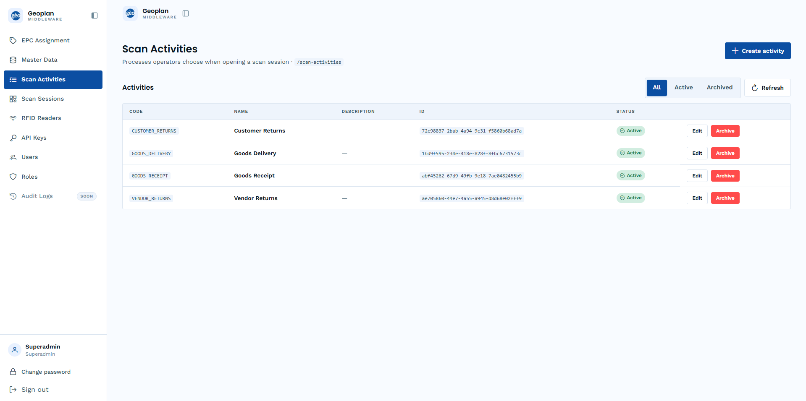

Geoplan preconfigures the four Samooha activities. Samooha does not create or archive them.

| Code | Name | ID |
| --- | --- | --- |
| `CR` | Customer Returns | `72c98837-2bab-4a94-9c31-f5860b68ad7a` |
| `GD` | Goods Delivery | `1bd9f595-234e-418e-828f-8fbc6731573c` |
| `GR` | Goods Receipt | `abf45262-67d9-49fb-9e18-7ae0482455b9` |
| `VR` | Vendor Returns | `ae705860-44e7-4a55-a945-d8d68e02fff9` |

The four IDs are confirmed in the staging deployment. Samooha may verify the active records without creating them:

```http
GET https://api-stg-sling.rgoc.com.ph/api/v1/scan-activities?isActive=true
x-api-key: <api-key>
```

The dashboard shows the configured code, name, ID, and active status:


