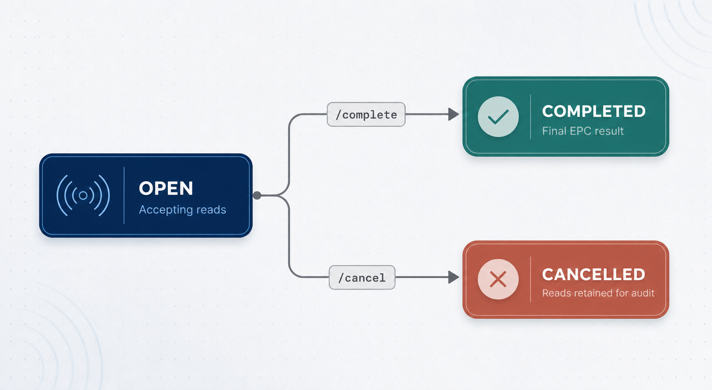

import { Steps } from '@astrojs/starlight/components';

Samooha controls scan sessions through the Geoplan API. No Scan Sessions UI is required for this integration.

## Connection

| Item | Value |
| --- | --- |
| Staging base URL | `https://api-stg-sling.rgoc.com.ph/api/v1` |
| Authentication | `x-api-key: <api-key>` |
| Content type | `application/json` |
| Contract rate limit | 60 requests per 5 minutes |
| Scan activities | Use the four fixed IDs in [Scan Activities](/samooha/scan-activities/) |

## Samooha flow rules

| Flow | Activity | `transactionReference` | Trigger | Agreed result to Samooha |
| --- | --- | --- | --- | --- |
| Goods Receipt | `GOODS_RECEIPT` | Purchase Invoice | Document creation | SKU and scanned quantity |
| Goods Delivery | `GOODS_DELIVERY` | Sales Order | Confirmation or posting | HTTP acknowledgement only |
| Customer Returns | `CUSTOMER_RETURNS` | Credit Note | Confirmation or posting | HTTP acknowledgement only |
| Vendor Returns | `VENDOR_RETURNS` | Debit Note | Confirmation or posting | HTTP acknowledgement only |

For the last three flows, the exact Samooha trigger is not yet settled between **Confirm** and **Post**.

Send `transactionReference` on every Samooha session. The current backend accepts it as optional and does not enforce uniqueness.

## Session lifecycle



| Status | Rule |
| --- | --- |
| `OPEN` | Accepts EPC reads. Initial state. |
| `COMPLETED` | Terminal. Set by `/complete`. |
| `CANCELLED` | Terminal. Set by `/cancel`. Captured reads remain for audit. |

Only an `OPEN` session can accept reads, complete, or cancel. Repeating a terminal action returns `409`.

## Current API sequence

<Steps>

1. **Open the session.** Samooha sends the fixed activity ID, document reference, and current reader identifier.

2. **Capture reads.** The Geoplan-managed reader or bridge sends EPC batches to `/reads`. Samooha does not call this endpoint.

3. **Monitor the session.** Samooha polls the session by ID. The current response contains the live deduplicated EPC list.

4. **Finish the session.** Samooha calls `/complete` for a successful scan or `/cancel` for an abandoned scan.

</Steps>

| Method | Path | Caller | Result |
| --- | --- | --- | --- |
| `POST` | `/epc-scan-processing/sessions` | Samooha | Create an `OPEN` session. Returns `201`. |
| `GET` | `/epc-scan-processing/sessions/{sessionId}` | Samooha | Read one session, including EPCs. |
| `GET` | `/epc-scan-processing/sessions` | Samooha | List sessions without EPC arrays. |
| `POST` | `/epc-scan-processing/sessions/{sessionId}/complete` | Samooha | Set `COMPLETED`. |
| `POST` | `/epc-scan-processing/sessions/{sessionId}/cancel` | Samooha | Set `CANCELLED`. |
| `POST` | `/epc-scan-processing/sessions/{sessionId}/reads` | Geoplan reader or bridge | Append and deduplicate EPC reads. |

## Open a session

```http
POST https://api-stg-sling.rgoc.com.ph/api/v1/epc-scan-processing/sessions
x-api-key: <api-key>
Content-Type: application/json
```

| Field | Current API | Samooha rule |
| --- | --- | --- |
| `scanActivityId` | Required UUID. Must reference an active activity. | Use the fixed ID for the flow. |
| `transactionReference` | Optional string, maximum 120 characters. | Always send the flow-specific document reference. |
| `deviceId` | Optional string, maximum 120 characters. | Final reader selection rule is pending. |

Request shape for Goods Receipt:

```json
{
  "scanActivityId": "abf45262-67d9-49fb-9e18-7ae0482455b9",
  "transactionReference": "<purchase-invoice>",
  "deviceId": "<reader-id>"
}
```

Current `201` response shape:

```json
{
  "statusCode": 201,
  "message": "Success",
  "data": {
    "id": "<session-id>",
    "transactionReference": "<purchase-invoice>",
    "deviceId": "<reader-id>",
    "scanActivity": {
      "id": "abf45262-67d9-49fb-9e18-7ae0482455b9",
      "code": "GOODS_RECEIPT",
      "name": "Goods Receipt"
    },
    "status": "OPEN",
    "startedAt": "<ISO-8601 timestamp>",
    "completedAt": null,
    "uniqueCount": 0,
    "epcs": []
  }
}
```

## Monitor a session

```http
GET https://api-stg-sling.rgoc.com.ph/api/v1/epc-scan-processing/sessions/<session-id>
x-api-key: <api-key>
```

| Response field | Type | Current behavior |
| --- | --- | --- |
| `id` | UUID | Session identifier. |
| `transactionReference` | string or `null` | Samooha document reference. |
| `deviceId` | string or `null` | Reader identifier supplied when the session opened. |
| `scanActivity` | object | Activity `id`, `code`, and `name`. |
| `status` | enum | `OPEN`, `COMPLETED`, or `CANCELLED`. |
| `startedAt` | ISO-8601 | Session creation time. |
| `completedAt` | ISO-8601 or `null` | Set only when completed. |
| `uniqueCount` | integer | Number of distinct EPCs. |
| `epcs` | string array | Trimmed, upper-cased, deduplicated, and sorted. |

The current endpoint exposes EPCs. The agreed Samooha Goods Receipt result is SKU and quantity. Samooha must not store EPCs.

## List sessions

```http
GET https://api-stg-sling.rgoc.com.ph/api/v1/epc-scan-processing/sessions?status=OPEN&page=1&limit=10
x-api-key: <api-key>
```

| Query | Type | Default | Rule |
| --- | --- | --- | --- |
| `status` | enum | None | `OPEN`, `COMPLETED`, or `CANCELLED`. |
| `deviceId` | string | None | Exact match. |
| `scanActivityId` | UUID | None | Filter by one activity. |
| `page` | integer | `1` | Minimum `1`. |
| `limit` | integer | `10` | `1` to `50`. |

List items include `uniqueCount` but omit `epcs`. Fetch one session for its reads.

## Complete or cancel

Both operations have no request body.

```http
POST https://api-stg-sling.rgoc.com.ph/api/v1/epc-scan-processing/sessions/<session-id>/complete
x-api-key: <api-key>
```

```http
POST https://api-stg-sling.rgoc.com.ph/api/v1/epc-scan-processing/sessions/<session-id>/cancel
x-api-key: <api-key>
```

`/complete` sets `completedAt`. `/cancel` leaves `completedAt` as `null`. Both return the full current session shape.

## Retry and duplicate rules

| Rule | Agreed behavior | Current backend |
| --- | --- | --- |
| Goods Receipt transmission failure | Up to three automatic retries, then a manual retry. No document cancellation. | Not implemented. |
| Completed duplicate | Reject a resend with the same document reference. | Not implemented. |
| Open duplicate | May overwrite the incomplete transaction. | Not implemented. |
| Manual resend | Show a confirmation before resending. | Not implemented. |

Retry delay, qualifying failures, and retry coverage for the other three flows are not final.

## Errors

| Status | Current session behavior |
| --- | --- |
| `400` | Invalid request, inactive activity, or no usable EPC value. |
| `401` | Missing or invalid API key. |
| `404` | Activity or session not found. |
| `409` | Session action requires `OPEN`, but the session is terminal. |
| `429` | Rate limit exceeded. |

See [Errors & Retries](/samooha/errors-and-retries/) for the shared HTTP status list.

## Draft limitations

| Area | Current state | Required before final publication |
| --- | --- | --- |
| Samooha transaction intake | No Goods Receipt, Goods Delivery, Customer Return, or Vendor Return document endpoints. | Final `POST` contracts and schemas. |
| Goods Receipt result | Completion returns EPC values. | Return SKU and quantity without EPCs. |
| Reader control | `deviceId` is optional text. No reader validation, start, stop, offline, or busy handling. | Final reader behavior. |
| Duplicate control | `transactionReference` is not unique. | Enforce the agreed completed and open duplicate rules. |
| Session limits | No timeout or per-reader concurrency rule. | Final timeout and concurrency behavior. |
| Goods Receipt lock | No unlock rule for a session that never completes. | Final unlock authority and audit behavior. |
| Unknown SKU or EPC | No final Samooha handling rule. | Use mapped UAT values until settled. |
| Rate enforcement | Backend uses 100 requests per 60 seconds. | Change to 60 requests per 5 minutes. |

The examples above show the current schema with placeholders. They are not captured staging transactions. Replace them with verified UAT requests and responses before final publication.
