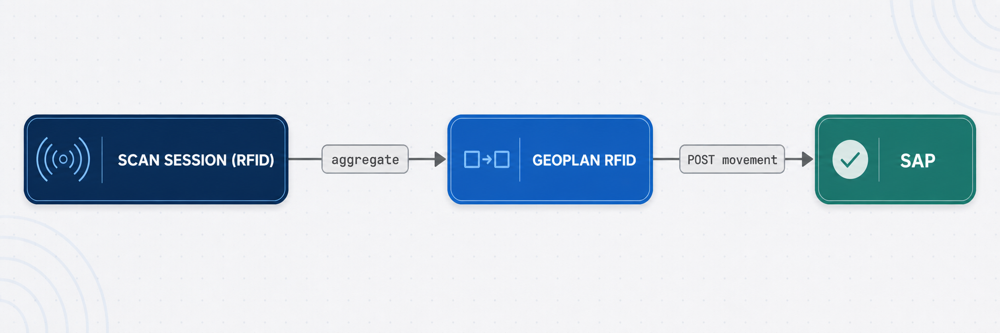

import { Aside } from '@astrojs/starlight/components';

<Aside type="caution">**Draft.** This is a proposed contract Geoplan is putting forward so SAP can build to it, not a live integration. Endpoints, fields, base URL, and auth are all subject to change. SAP develops the APIs below if they don't already exist.</Aside>

When a scan closes, the RFID middleware aggregates it into a business event and posts the resulting goods movement to SAP. This page defines the endpoints and fields **SAP exposes and Geoplan RFID calls**, the reverse of the rest of this reference, where clients call Geoplan.

## Direction



- **SAP hosts** the endpoints below. **Geoplan RFID is the client.**
- **Base URL**: SAP host, to be provided by SAP.
- **Auth**: SAP-defined (e.g. OAuth / mTLS / basic). Not the `x-api-key` used elsewhere in this reference.
- Payloads are proposed as JSON. SAP may map fields onto its own objects (MM/SD/EWM).

## Movements (core set)

One `POST` per movement type, each mapping to a distinct SAP object. All four share the [common envelope](#request-envelope) below.

| endpoint (SAP-hosted) | `movementType` | SAP object |
| --- | --- | --- |
| `POST /rfid/goods-receipts` | `GOODS_RECEIPT` | Goods Receipt (PO / Inbound Delivery / ASN) |
| `POST /rfid/goods-issues` | `GOODS_ISSUE` | Post Goods Issue (Outbound Delivery) |
| `POST /rfid/stock-transfers` | `STOCK_TRANSFER` | STO Goods Issue / Receipt |
| `POST /rfid/inventory-adjustments` | `INVENTORY_ADJUSTMENT` | Inventory Difference / Physical Inventory Doc |

More movement types (POS sale decrement, customer/vendor returns, store receiving) follow the same shape and get added as the scope firms up.

## Request envelope

Every movement `POST` sends the same body. `movementType` distinguishes them. The endpoint path is a convenience that mirrors it.

```json
{
  "movementType": "GOODS_RECEIPT",
  "documentRef": "PO-4500012345",
  "documentType": "PURCHASE_ORDER",
  "warehouseCode": "WH01",
  "scanSessionId": "38a7393e-7750-4437-9c0f-b69db6e247b5",
  "scannedAt": "2026-07-22T02:10:20.000Z",
  "lines": [
    { "sku": "ZRA-FOO-OLI-40-036815", "gtin": "7067600196000", "quantity": 12, "epcs": ["3034F4A9…01", "3034F4A9…02"] }
  ]
}
```

### Fields

| field | type | required | RFID source / note |
| --- | --- | --- | --- |
| `movementType` | enum | yes | `GOODS_RECEIPT` \| `GOODS_ISSUE` \| `STOCK_TRANSFER` \| `INVENTORY_ADJUSTMENT`. From the scan activity |
| `documentRef` | string | yes | SAP source doc no. (PO / Delivery / STO). RFID `transactionReference` |
| `documentType` | enum | no | `PURCHASE_ORDER` \| `INBOUND_DELIVERY` \| `OUTBOUND_DELIVERY` \| `STO` \| … |
| `warehouseCode` | string | yes | Plant / storage location the scan happened at |
| `scanSessionId` | uuid | no | RFID session, for traceability / idempotency |
| `scannedAt` | ISO-8601 | no | When the session completed |
| `lines[].sku` | string | yes | Resolved from scanned EPCs |
| `lines[].gtin` | string | no | |
| `lines[].quantity` | int | yes | Distinct EPCs scanned for the SKU |
| `lines[].epcs` | string[] | no | The EPCs behind the quantity, for audit |

## Response

Same shape for all four endpoints.

```json
{
  "status": "POSTED",
  "sapDocumentNumber": "5000004567",
  "postedAt": "2026-07-22T02:10:25.000Z",
  "messages": [
    { "sku": "ZRA-FOO-OLI-40-036815", "type": "WARNING", "text": "Posted with over-delivery tolerance" }
  ]
}
```

| field | type | note |
| --- | --- | --- |
| `status` | enum | `POSTED` \| `FAILED` \| `PARTIAL` |
| `sapDocumentNumber` | string | the material / delivery doc SAP created |
| `postedAt` | ISO-8601 | |
| `messages` | array | per-line info / warnings / errors (`sku`, `type`, `text`) |

## GET /rfid/documents: optional source document

Lets RFID pull the expected document before scanning, to validate scanned quantity against expected. Optional for the first cut.

| param | type | notes |
| --- | --- | --- |
| `type` | enum | `PURCHASE_ORDER` \| `INBOUND_DELIVERY` \| `STO` \| … |
| `ref` | string | the document number |

```json
{
  "documentRef": "PO-4500012345",
  "documentType": "PURCHASE_ORDER",
  "warehouseCode": "WH01",
  "lines": [
    { "sku": "ZRA-FOO-OLI-40-036815", "gtin": "7067600196000", "expectedQuantity": 12 }
  ]
}
```

## To confirm with SAP

- Auth scheme + base URL.
- Idempotency: an idempotency key (e.g. `scanSessionId`) so a retry never double-posts.
- Error semantics: partial-post handling, per-line vs whole-document rejection.
- Do batch / serial-managed materials need extra fields?
- Plant vs storage-location granularity for `warehouseCode`.
- Whether SAP would rather **push** documents to RFID than have RFID pull them via `GET /rfid/documents`.

## RFID-side prerequisites

For Geoplan to build the payload above, the middleware still needs to:

1. Capture **`warehouseCode`**. Not stored on a scan today. Add it to the session or derive it from the reader's location.
2. Aggregate **quantity per SKU**. Resolve session EPCs to SKUs (via master data) and count.
3. Map **scan activity → `movementType`**, and carry `transactionReference` as `documentRef`.
